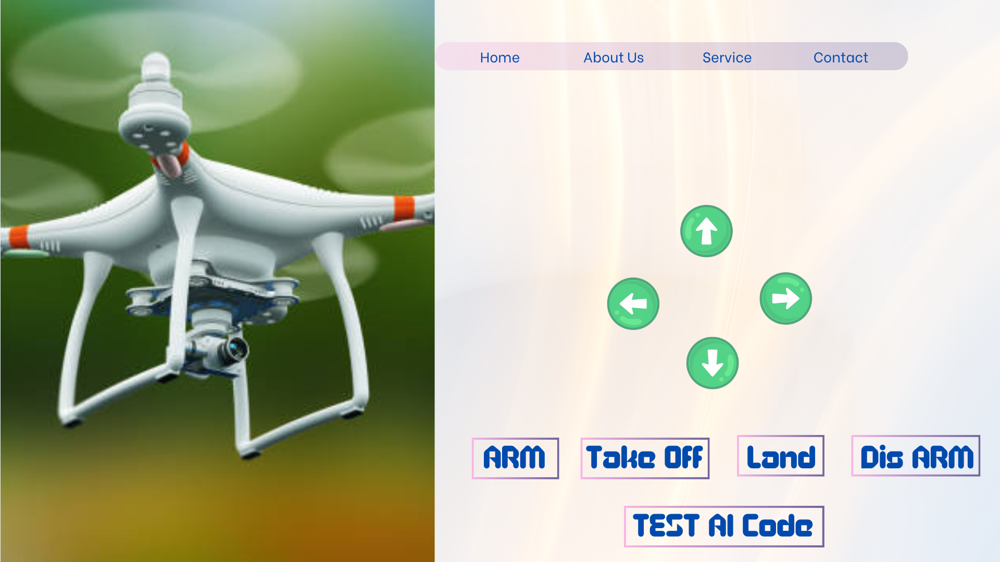

# 🛸 AI-Powered Smart Drone System

This project demonstrates the full integration of GUI-based control, autonomous flight, and AI-powered object tracking. Built using **Pixhawk**, **Jetson Nano**, and **Ultralytics YOLO** with **BoT-SORT** tracker, the system is a step forward in developing smart, responsive drone systems for real-world applications.

---

## 🚀 Project Overview

The drone system is designed to:
- Perform **autonomous flight** using Pixhawk flight controller.
- Execute **real-time object detection** using YOLOv8 on Jetson Nano.
- Apply **BoT-SORT** tracking for consistent object ID across frames.
- Provide a **Graphical User Interface (GUI)** for manual control and monitoring.

---

## 🧠 Key Features

- ✅ AI-based real-time object detection using **Ultralytics YOLOv8**
- ✅ Robust object tracking with **BoT-SORT**
- ✅ Autonomous flight path planning with **Pixhawk**
- ✅ **Jetson Nano** onboard inference
- ✅ **GUI interface** for remote control and visualization

---

## 🛠️ Hardware Components

- **Pixhawk** (Flight controller)
- **Jetson Nano** (AI inference)
- **Camera module** (for live video feed)
- **ESCs + Motors + Propellers**
- **Battery + Power Distribution**
- **Telemetry module or Wi-Fi for communication**

---

## 🧰 Software Stack

| Component        | Technology Used              |
|------------------|------------------------------|
| Object Detection | YOLOv8 (Ultralytics)         |
| Object Tracking  | BoT-SORT                     |
| Control System   | MAVLink, PX4/ArduPilot       |
| GUI Interface    | Python (Tkinter / PyQt)      |
| Platform         | Jetson Nano (Ubuntu)         |

---

## 🔄 Workflow

1. **Camera Feed** → Captured by Jetson Nano  
2. **Detection** → Processed with YOLOv8  
3. **Tracking** → Enhanced using BoT-SORT  
4. **Decision Making** → Send movement commands to Pixhawk  
5. **Flight Control** → Executed via MAVLink  
6. **GUI Display** → Real-time feedback to user

---

## 🖥️ User Interface

Here is a snapshot of the control and tracking GUI:

_The interface allows live monitoring, manual control options, and visualization of detected and tracked objects._

---

## 📂 Project Structure (Example)

